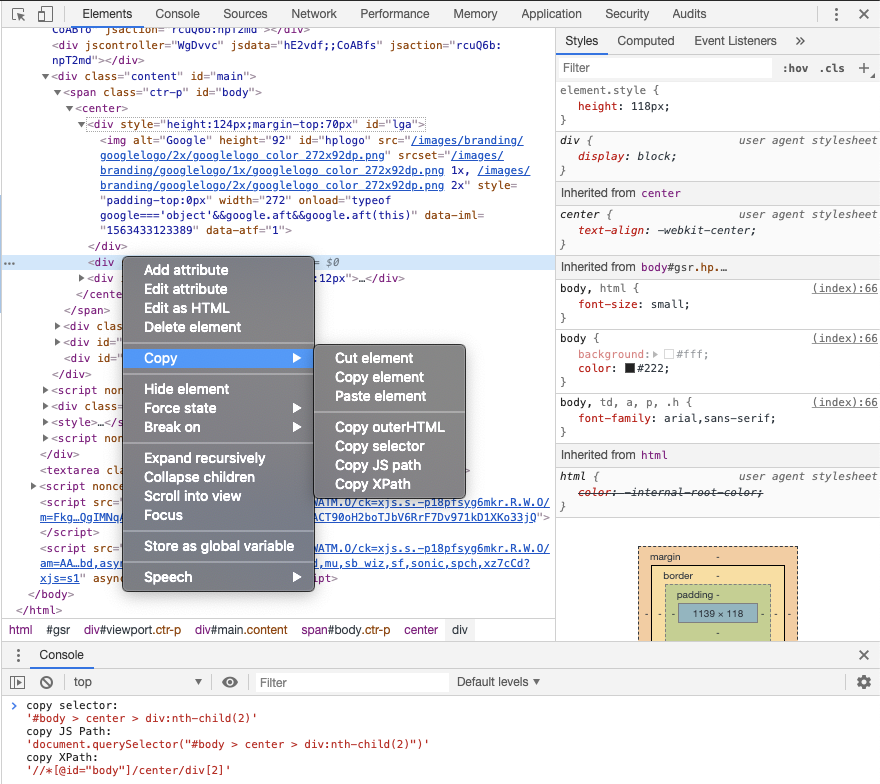

This package is a [little piece](https://github.com/ChromeDevTools/devtools-frontend/blob/6b5621bb7709854a4697b3aa794822c5898f4d09/front_end/elements/DOMPath.js) of [Google's Chromium DevTools project](https://github.com/ChromeDevTools/devtools-frontend) which modified to make it work on JSDOM.

The DOMPath is responsible for generating a selector given an element in a particular DOM hierarchy.
Its methods can be accessed via the following menu:
```Open DevTools -> Navigate to Elements tab -> Right click on selected Element -> Copy```


## Installation
[](https://www.npmjs.com/package/chrome-dompath) [](https://npm-stat.com/charts.html?package=chrome-dompath)[](https://github.com/testimio/chrome-dompath/blob/master/LICENSE)
```
npm i -S chrome-dompath
```

## DOMPath

Get selector, JS Path and XPath of a DOM element.

```js
const DOMPath = require('chrome-dompath');

// Node
const dom = new JSDOM('<root><a><b>T1</b><c>T2</c></a></root>').window.document;
const element = dom.querySelector('b');

// Browser
const element = window.document.querySelector('b');

DOMPath.fullQualifiedSelector(element, true);
DOMPath.jsPath(element, true);
DOMPath.xPath(element, true);
```

## API

### `DOMPath.fullQualifiedSelector(node: DOMNode | optimized: boolean)`

Returns the full qualified selector (string) for the node supplied.

```js
DOMPath.fullQualifiedSelector(element);
DOMPath.fullQualifiedSelector(element, true);
```

### `DOMPath.jsPath(node: DOMNode | optimized: boolean)`

Returns the JS path (string) for the node supplied.

```js
DOMPath.jsPath(element);
DOMPath.jsPath(element, true);
```

### `DOMPath.xPath(node: DOMNode | optimized: boolean)`

Returns the xpath (string) for the node supplied.

```js
DOMPath.xpath(element);
DOMPath.xpath(element, true);
```